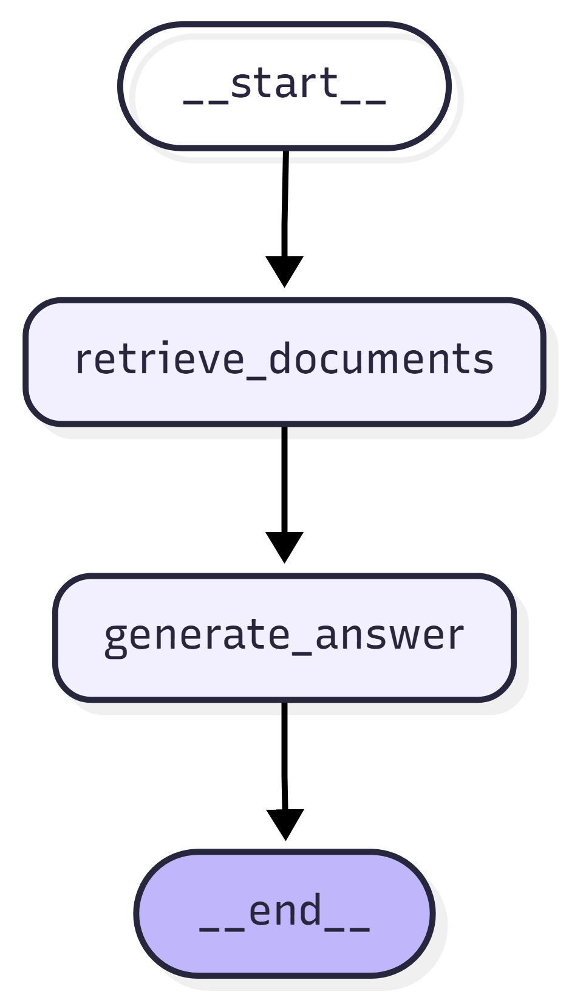

# Shipment Intelligence System

An AI-powered shipment monitoring system that combines a **multi-agent orchestration pipeline** with a **RAG-based chatbot** to autonomously investigate shipment events, detect delays, classify risk levels, and trigger escalations — without human intervention.

Built with **LangGraph**, **LangChain**, **FastAPI**, **Qdrant**, and **Docker**.

---

## Demo

| Interface | Description |
|---|---|
| `http://localhost:3000` | Landing page |
| `http://localhost:3000/agents-ui.html` | Agent pipeline trigger & progress monitor |
| `http://localhost:3000/rag-chatbot-ui.html` | RAG chatbot for shipment queries |

---

## System Overview

### 1. Multi-Agent Orchestration Pipeline

A **customized multi-agent workflow DAG** built with LangGraph. Each agent is a node in the graph — some agents are pure data-fetching nodes (no LLM), while others use LLM reasoning with tool-calling, autonomously choosing which tools to invoke based on the input and context.

Incoming events are handled differently depending on their channel before entering the pipeline:

```
Incoming Event
      │
      ├── channel: email / sms / call
      │         │
      │         ▼
      │   ┌─────────────────────────────┐
      │   │     Ingestion Step          │
      │   │  Embed & store event in     │
      │   │  Qdrant vector store        │
      │   │  → then trigger pipeline    │
      │   └─────────────┬───────────────┘
      │                 │
      └── channel: tms  │
                │       │
                └───────┘
                        │
                        ▼
        ┌─────────────────────────────────────┐
        │         Retrieval Agent             │
        │  (LLM — structured output &         │
        │   data fetching)                    │
        │  • fetch_customer_data (ext. API)   │
        │  • fetch_shipment_event (RAG)       │
        │  • fetch_tms_data (ext. API)        │
        └────────────────┬────────────────────┘
                         │
                         ▼
        ┌─────────────────────────────────────┐
        │          Analysis Agent             │
        │  (LLM + tools — chooses tools       │
        │   based on context)                 │
        │  Tools:                             │
        │    - check_weather                  │
        └────────────────┬────────────────────┘
                         │
                         ▼
        ┌─────────────────────────────────────┐
        │          Response Agent             │
        │  (LLM — structured output,          │
        │   no tools)                         │
        │  • Risk classification:             │
        │    LOW      → < 12h delay           │
        │    MEDIUM   → 12–24h delay          │
        │    HIGH     → > 24h delay           │
        │    CRITICAL → > 48h delay           │
        │  • should_escalate = true if        │
        │    risk is MEDIUM or higher         │
        │  • Generates confidence score       │
        │    (0.0–1.0) & summary              │
        └────────────────┬────────────────────┘
                         │ (MEDIUM / HIGH / CRITICAL)
                         ▼
        ┌─────────────────────────────────────┐
        │         Escalation Agent            │
        │  (LLM + tools — chooses tools       │
        │   based on risk & context)          │
        │  Tools:                             │
        │    - send_sms                       │
        │    - send_email                     │
        │    - create_support_ticket          │
        └─────────────────────────────────────┘
```

### Workflow Diagram


---

### 2. RAG Chatbot

A separate LangGraph + LangChain pipeline for natural language queries against shipment history stored in Qdrant. Supports **hybrid search** (dense + sparse retrieval) for more accurate and complete results.

```
User Query → retrieve_documents (Qdrant hybrid search) → generate_answer (LLM) → Response
```



---

## Design Principles

- TMS events trigger the pipeline directly; email/SMS/call events are **ingested into the vector store first**
- Tools are used only for **data access and external systems**, not reasoning
- Each agent has focused tools — agents with tools autonomously decide which to call based on input
- **Retrieval, analysis, and action** are cleanly separated across agents
- **Structured outputs** from the Response Agent enable reliable conditional branching
- Orchestration is an **explicit DAG** — no hidden prompt-driven workflows

---

## Tech Stack

| Layer | Technology |
|---|---|
| Agent Orchestration | LangGraph + LangChain |
| API | FastAPI (Python 3.12) |
| Vector Store | Qdrant |
| Embeddings | OpenAI / GoogleAI / FastEmbed (Prithivida) |
| LLM | OpenAI / GoogleAI |
| Dependency Management | Poetry |
| Frontend | HTML / CSS / JS (nginx) |
| Containerization | Docker + Docker Compose |

---

## Project Structure

```
root/
├── docs/
│   ├── agent-workflow.png          # LangGraph agent pipeline diagram
│   └── rag-pipeline.png            # RAG pipeline diagram
├── docker-compose.yaml
├── README.md
├── backend/
│   ├── Dockerfile
│   ├── pyproject.toml
│   ├── poetry.lock
│   ├── .env.example
│   ├── mock_data/                  # Sample shipment events & data for local testing
│   │   ├── data.py
│   │   └── events.md
│   └── shipment_intelligence_api/
│       ├── main.py
│       ├── agents/
│       │   ├── orchestrator/       # LangGraph workflow & state
│       │   ├── retrieval_agent/    # Data fetching (LLM + structured output)
│       │   ├── analysis_agent/     # Delay detection & root cause
│       │   ├── response_agent/     # Risk classification (structured output)
│       │   └── escalation_agent/   # Notifications & ticketing
│       ├── rag/                    # RAG pipeline (retrieve → generate)
│       ├── infrastructure/
│       │   ├── llm/                # LLM provider
│       │   ├── embeddings/         # Embedding provider
│       │   └── vector_store/       # Qdrant client & store manager
│       ├── core/                   # Settings, logging, exceptions
│       ├── progress/               # Runtime-generated pipeline progress files (per shipment)
│       └── logs/                   # Application logs (app.log)
└── frontend/
    ├── Dockerfile
    ├── config.js
    ├── index.html                  # Landing page
    ├── agents-ui.html              # Agent pipeline UI
    └── rag-chatbot-ui.html         # RAG chatbot UI
```

> **Demo Note:** Pipeline progress is tracked via text files in `progress/` (one file per shipment ID e.g. `SHP1009.txt`). In real-time this would be replaced with a database or message queue. Application logs are written to `logs/app.log`.

---

## Getting Started

### Prerequisites

- [Docker](https://docs.docker.com/get-docker/)
- [Docker Compose](https://docs.docker.com/compose/install/)

### 1. Clone the repository

```bash
git clone https://github.com/SURYA-S-A/shipment-intelligence.git
cd shipment-intelligence
```

### 2. Configure environment variables

```bash
cp backend/.env.example backend/.env
```

Edit `backend/.env`:

```env
OPENAI_API_KEY=your_openai_api_key
QDRANT_URL=http://qdrant:6333
QDRANT_API_KEY=mysecretapikey
```

### 3. Run with Docker

```bash
docker compose up --build -d
```

### 4. Open the UI

Visit [http://localhost:3000](http://localhost:3000)

---

## Services

| Service | Port | Description |
|---|---|---|
| `shipment-intelligence-ui` | `3000` | Static frontend (nginx) |
| `shipment-intelligence-api` | `8100` | FastAPI backend |
| `shipment-intelligence-qdrant` | `6333` | Qdrant vector database |

---

## API Endpoints

Base URL: `http://localhost:8100/api`

| Method | Endpoint | Description |
|---|---|---|
| `POST` | `/agents/incoming-communication` | Trigger the agent pipeline |
| `GET` | `/agents/progress/{shipment_id}` | Poll pipeline progress |
| `POST` | `/rag/query` | Query shipment data via RAG |
| `GET` | `/health` | Health check |

### Example — Trigger Pipeline (TMS)

```bash
curl -X POST http://localhost:8100/api/agents/incoming-communication \
  -H "Content-Type: application/json" \
  -d '{
    "channel": "tms_event",
    "shipment_id": "SHP1009",
    "timestamp": "2026-02-23T08:00:00Z"
  }'
```

### Example — Trigger Pipeline (Email — ingests then runs)

```bash
curl -X POST http://localhost:8100/api/agents/incoming-communication \
  -H "Content-Type: application/json" \
  -d '{
    "channel": "email",
    "source": "dispatch@carrier.com",
    "content": "Shipment SHP1009 delayed due to weather conditions.",
    "timestamp": "2026-02-23T08:00:00Z"
  }'
```

### Example — RAG Query

```bash
curl -X POST http://localhost:8100/api/rag/query \
  -H "Content-Type: application/json" \
  -d '{"question": "What happened to shipment SHP1009?"}'
```

---

## Useful Commands

```bash
# Start in detached mode
docker compose up --build -d

# View logs
docker compose logs -f

# Rebuild after changes
docker compose up --build --force-recreate -d

# Stop services
docker compose down

# Stop and remove volumes
docker compose down -v
```